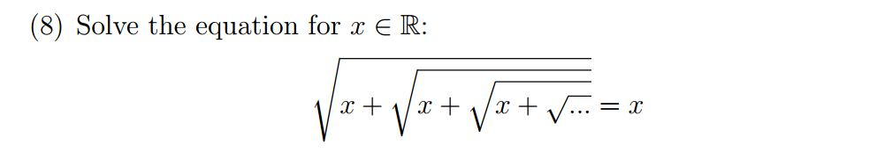

```{r setup, include=FALSE}
library(flexdashboard)
```

Column {data-width=650}
-----------------------------------------------------------------------

### Proof

$$\sqrt{x+\sqrt{x+\sqrt{x+\sqrt{...}}}}=x$$

$$x+\sqrt{x+\sqrt{x+\sqrt{...}}}=x^2$$

$$\sqrt{x+\sqrt{x+\sqrt{...}}}=x^2-x$$

$$x=x^2-x$$

$$0=x^2-2x$$

$$0=(x)(x-2)$$

```{r, echo=TRUE}

equation <- function(x, iter) {
  if (iter == 0) {
    return(sqrt(x))
  } else {
    return(sqrt(x+equation(x, iter-1)))
  }
}

equation(0,100)
equation(2,100)
```

Q.E.D.


Column {data-width=350}
-----------------------------------------------------------------------

### Original Question




```{r}

```

### Experimental Solution

```{r, echo=TRUE}

# equation(0.1,100)
# equation(0.5,100)
equation(1, 100)
```
There is our good friend $$\phi$$ again! 

Keep increasing X until we get the answer ...

```{r, echo=TRUE}
equation(1.1, 100)
# ...
# equation(1.8, 100)
# equation(1.99, 100)
equation(2, 100)
```

Make sure it isn't true for any other values higher than 2 ?

```{r, echo=TRUE}
equation(2.1, 100)
equation(3, 100)
```