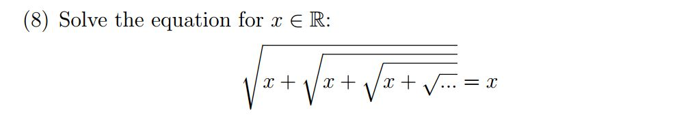

```{r setup, include=FALSE}
library(flexdashboard)
```

Column {data-width=650}
-----------------------------------------------------------------------

### Let's prove Phi (captial phi)

Recall that 
$$\frac{1}{\frac{1}{x}} == x$$

And that 
$$\phi = 1 + \frac{1}{1+\frac{1}{1+\frac{1}{1+...}}}$$

So our our original question (see right):
$$y = \frac{1}{1+\frac{1}{1+\frac{1}{1+...}}}$$
is just phi - 1.

maybe if we invert this fraction then we get 
$$\frac{1}{y} = 1+\frac{1}{1+\frac{1}{1+...}}$$

we can probably get our original thing again if we move things around again:
$$\frac{1}{y} - 1 = \frac{1}{1+\frac{1}{1+...}} = y$$

From there:
$$\frac{1}{y} - 1 = y$$

$$1 - y = y^2$$

$$y^2 + y - 1 = 0$$

Well that's almost a quadratic but it's not quite the {-1,1} droids I was looking for.

$$y^2 + y - 1 = 0$$

[Complete the square, if you are so inclined](http://www.sosmath.com/algebra/solve/solve4/s45/s45/s45.html)

Final Answer
$$y = \pm\frac{1- \sqrt{5}}{2}$$

```

```


```{r, echo = TRUE}

```

Column {data-width=350}
-----------------------------------------------------------------------

### Original Question


```{r}

```

### Implementation

At first glance we can just start doing the sequence n times and see what it approaches 

1
1/2
2/3 ... ? ow  my brain hurts, use R

```{r, echo=TRUE}

findY <- function(iterations) {
  if (iterations==0) {
    return(1)
  } else {
    return(1/(1 + findY(iterations-1)))
  }
}

findY(1)

findY(2)

findY(3)

findY(4)

findY(5)

findY(50)
```

So that looks pretty close to $$\phi$$ the golden ratio.

[golden ratio](https://en.wikipedia.org/wiki/Golden_ratio)

Note tha phi is usually 1.618... not 0.618... which is the question being asked here.

The 0.618... is basically the short over long segment of the golden ratio rather than the long over the short and is called

"Golden Ratio Conjugate"

$$\Phi = \phi^{-1}$$

#### Bonus Question

